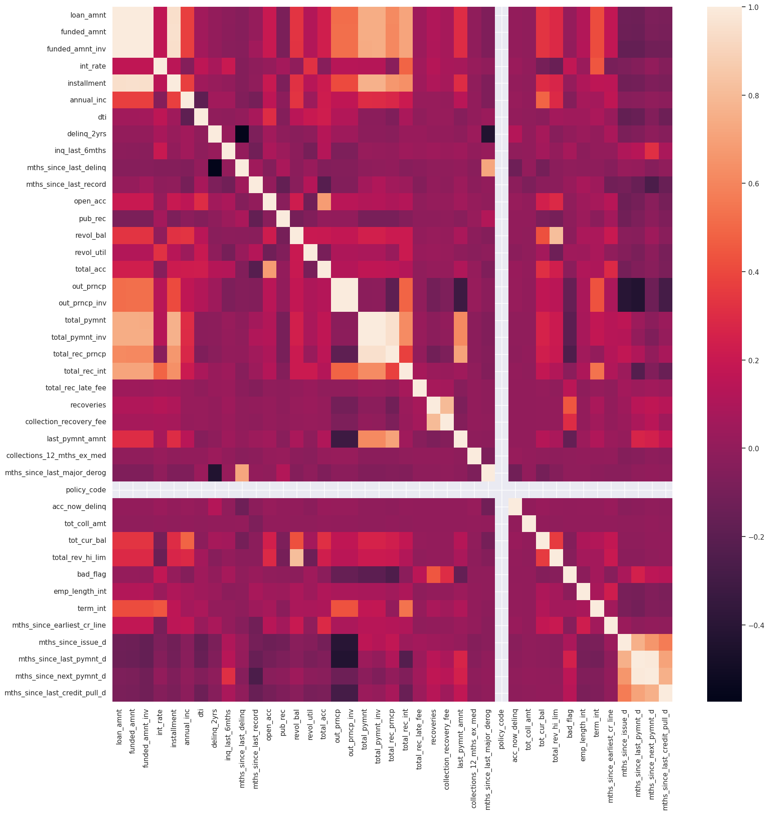
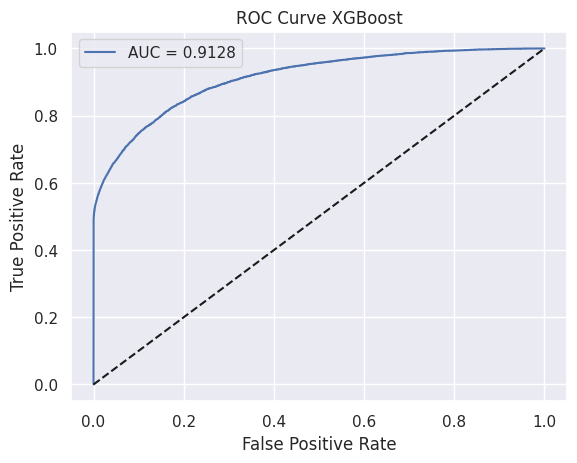
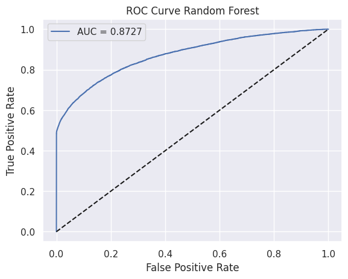
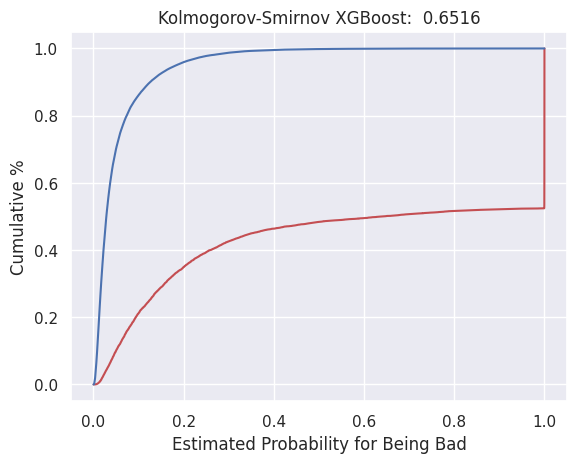
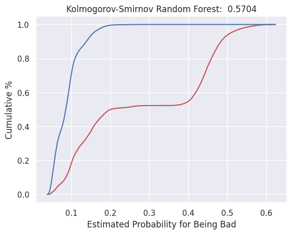

# Laporan Proyek Credit Risk Prediction - Syahvan Alviansyah

## Domain Proyek

Dalam industri finansial, penilaian risiko kredit adalah salah satu aspek yang sangat penting. Hal ini karena risiko kredit merupakan faktor utama yang mempengaruhi kesehatan keuangan sebuah perusahaan. Pemberian  kredit  dapat  mengalami  berbagai  masalah ataupun  risiko.  Permasalahan atau risiko yang dapat dialami dalam pemberian kredit adalah sikap  nasabah  yang tidak  melakukan pembayaran angsuran  secara  tepat  waktu   taupun  menunda pembayaran sampai  beberapa  bulan  pembayaran angsuran  yang  menyebabkan  terjadinya  kredit  macet (Hasan, 2017). Dalam konteks ini, proyek _Credit Risk Prediction_ memainkan peran kunci dalam membantu perusahaan finansial dalam membuat keputusan pemberian pinjaman yang lebih baik. Melalui analisis data historis pinjaman, perusahaan dapat mengidentifikasi pola-pola yang berkaitan dengan pelunasan pinjaman dan mengembangkan model prediksi untuk memproyeksikan kemungkinan seorang peminjam untuk melunasi pinjaman di masa depan.

## Business Understanding

### Problem Statements

Berdasarkan latar belakang di atas, berikut ini batasan masalah yang dapat diselesaikan dengan proyek ini:
- Bagaimana mengembangkan model prediksi yang dapat memproyeksikan kemungkinan seorang peminjam untuk melunasi pinjaman di masa depan?
- Bagaimana meningkatkan keputusan pemberian pinjaman dengan mengurangi risiko kredit yang tidak diinginkan?
- Bagaimana cara menentukan hasil prediksi suatu algoritma _machine learning_ dapat dikatakan baik?

### Goals

Menjelaskan tujuan dari pernyataan masalah:
- Mengembangkan model prediksi risiko kredit yang memiliki akurasi tinggi.
- Mengurangi tingkat risiko kredit yang tidak diinginkan dalam keputusan pemberian pinjaman.
- Melakukan evaluasi terhadap metrik dari masing-masing algoritma.

### Solution Statements

- Melakukan pemodelan menggunakan beberapa algoritma _machine learning_ seperti XGBoost dan Random Forest untuk mencapai solusi yang diinginkan.
- Melakukan evaluasi model menggunakan classification report, AUC-ROC, dan Kolmogorov-Smirnov.

## Data Understanding
Dataset yang digunakan merupakan data credit dari tahun 2007-2014 yang berasal dari [LendingClub](https://www.kaggle.com/datasets/devanshi23/loan-data-2007-2014), sebuah perusahaan _Peer-to-Peer_ (P2P) Lending yang berbasis di Amerika Serikat. Dataset tersebut berisi 466285 baris dan 74 kolom.

### Variabel-variabel pada Dataset LendingClub adalah sebagai berikut:
- `id`: ID unik yang ditetapkan LendingClub untuk daftar pinjaman. 
- `member_id`: Id unik yang ditetapkan untuk anggota peminjam.
- `loan_amnt`: Jumlah pinjaman yang tercantum yang diajukan oleh peminjam. Jika suatu saat departemen kredit mengurangi jumlah pinjaman, maka hal itu akan tercermin dalam nilai ini.
- `funded_amnt`: Jumlah total yang berkomitmen untuk pinjaman tersebut pada saat itu.
- `funded_amnt_inv`: Jumlah total yang berkomitmen oleh investor untuk pinjaman tersebut pada saat itu.
- `term`: Jumlah pembayaran pinjaman. Nilai dalam bulan dan dapat berupa 36 atau 60.          
- `int_rate`: Suku Bunga pinjaman
- `installment`: Pembayaran bulanan yang harus dibayar oleh peminjam jika pinjaman itu berasal.
- `grade`: Tingkat pinjaman               
- `sub_grade`: Tanah dasar pinjaman           
- `emp_title`: Jabatan yang diberikan oleh Peminjam saat mengajukan pinjaman.                    
- `emp_length`: Lamanya masa kerja dalam tahun. Nilai yang mungkin adalah antara 0 dan 10 dimana 0 berarti kurang dari satu tahun dan 10 berarti sepuluh tahun atau lebih.
- `home_ownership`: Status kepemilikan rumah yang diberikan oleh peminjam pada saat pendaftaran. Nilai-nilai: SEWA, SENDIRI, KPR, LAINNYA.      
- `annual_inc`: Pendapatan tahunan yang dilaporkan sendiri yang diberikan oleh peminjam saat pendaftaran.
- `verification_status`: Status verifikasi.
- `issue_d`: Bulan dimana pinjaman itu didanai.            
- `loan_status`: Status pinjaman saat ini.         
- `pymnt_plan`: Menunjukkan apakah rencana pembayaran telah diterapkan untuk pinjaman      
- `url`: URL untuk halaman LendingClub dengan data daftar.
- `desc`: Deskripsi pinjaman yang diberikan oleh peminjam.
- `purpose`: Kategori yang disediakan oleh peminjam untuk permintaan pinjaman.             
- `title`: Judul pinjaman yang diberikan oleh peminjam.
- `zip_code`: 3 angka pertama kode pos yang diberikan peminjam dalam permohonan pinjaman.             
- `addr_state`: Negara yang disediakan oleh peminjam dalam permohonan pinjaman.          
- `dti`: Rasio yang dihitung menggunakan total pembayaran utang bulanan peminjam terhadap total kewajiban utang, tidak termasuk hipotek dan pinjaman LC yang diminta, dibagi dengan pendapatan bulanan peminjam yang dilaporkan sendiri.             
- `delinq_2yrs`: Jumlah kejadian tunggakan lebih dari 30 hari dalam arsip kredit peminjam selama 2 tahun terakhir.     
- `earliest_cr_line`: Bulan dimana batas kredit peminjam yang paling awal dilaporkan dibuka.
- `inq_last_6mths`: Jumlah pertanyaan dalam 6 bulan terakhir (tidak termasuk pertanyaan otomotif dan hipotek).  
- `mths_since_last_delinq`: Jumlah bulan sejak tunggakan terakhir peminjam.
- `mths_since_last_record`: Jumlah bulan sejak pencatatan publik terakhir.
- `open_acc`: Jumlah jalur kredit terbuka dalam file kredit peminjam.        
- `pub_rec`: Jumlah catatan publik yang menghina.         
- `revol_bal`: Total saldo kredit bergulir
- `revol_util`: Tingkat pemanfaatan jalur bergulir, atau jumlah kredit yang digunakan peminjam relatif terhadap seluruh kredit bergulir yang tersedia.
- `total_acc`: Jumlah total batas kredit yang saat ini ada dalam arsip kredit peminjam.       
- `initial_list_status`: Status pencatatan awal pinjaman. Nilai yang mungkin adalah – W, ​​F 
- `out_prncp`: Sisa pokok terutang untuk jumlah total yang didanai.       
- `out_prncp_inv`: Sisa pokok terutang untuk sebagian dari jumlah total yang didanai oleh investor.   
- `total_pymnt`: Pembayaran diterima sampai saat ini untuk jumlah total yang didanai.     
- `total_pymnt_inv`: Pembayaran diterima hingga saat ini untuk sebagian dari jumlah total yang didanai oleh investor 
- `total_rec_prncp`: Pokok sudah diterima sampai saat ini. 
- `total_rec_int`: Bunga yang diterima sampai saat ini.   
- `total_rec_late_fee`: Biaya keterlambatan diterima sampai saat ini.
- `recoveries`: Pasca biaya dari pemulihan kotor.      
- `collection_recovery_fee`: Biaya pos dari biaya pengambilan.
- `last_pymnt_d`: Pembayaran bulan lalu telah diterima.
- `last_pymnt_amnt`: Jumlah total pembayaran terakhir yang diterima. 
- `next_pymnt_d`: Tanggal pembayaran terjadwal berikutnya.
- `last_credit_pull_d`: Bulan terakhir LC menarik kredit untuk pinjaman ini.
- `collections_12_mths_ex_med`: Jumlah koleksi dalam 12 bulan tidak termasuk koleksi medis.
- `mths_since_last_major_derog`: Bulan sejak rating 90 hari terakhir atau lebih buruk.
- `policy_code`: policy_code=1 tersedia untuk umum produk baru tidak tersedia untuk umum policy_code=2.
- `application_type`: Menunjukkan apakah pinjaman tersebut merupakan permohonan perorangan atau permohonan bersama dengan dua peminjam bersama.    
- `annual_inc_joint`: Gabungan pendapatan tahunan yang dilaporkan sendiri yang diberikan oleh peminjam bersama pada saat pendaftaran.    
- `dti_joint`: Rasio yang dihitung menggunakan total pembayaran bulanan rekan peminjam terhadap total kewajiban hutang, tidak termasuk hipotek dan pinjaman LC yang diminta, dibagi dengan gabungan pendapatan bulanan yang dilaporkan sendiri oleh rekan peminjam.
- `verification_status_joint`: Menunjukkan apakah pendapatan bersama peminjam bersama telah diverifikasi oleh LC, tidak diverifikasi, atau jika sumber pendapatan telah diverifikasi. 
- `acc_now_delinq`: Jumlah rekening dimana peminjam sekarang menunggak.  
- `tot_coll_amt`: Total jumlah penagihan yang terutang.      
- `tot_cur_bal`: Total saldo saat ini dari semua akun.       
- `open_acc_6m`: Jumlah perdagangan terbuka dalam 6 bulan terakhir. 
- `open_il_6m`: Jumlah perdagangan cicilan yang aktif saat ini.  
- `open_il_12m`: Jumlah rekening angsuran yang dibuka dalam 12 bulan terakhir. 
- `open_il_24m`: Jumlah rekening angsuran yang dibuka dalam 24 bulan terakhir. 
- `mths_since_rcnt_il`: Bulan sejak rekening cicilan terakhir dibuka.  
- `total_bal_il`: Total saldo saat ini dari semua rekening angsuran.
- `il_util`: Rasio total saldo saat ini terhadap kredit/batas kredit yang tinggi pada semua akun pemasangan.     
- `open_rv_12m`: Jumlah perdagangan bergulir yang dibuka dalam 12 bulan terakhir. 
- `open_rv_24m`: Jumlah perdagangan bergulir yang dibuka dalam 24 bulan terakhir. 
- `max_bal_bc`: Saldo terhutang maksimum saat ini pada semua akun bergulir.  
- `all_util`: Saldo hingga batas kredit pada semua perdagangan.    
- `total_rev_hi_lim`: Total batas kredit/kredit tinggi yang bergulir.  
- `inq_fi`: Jumlah pertanyaan keuangan pribadi.      
- `total_cu_tl`: Jumlah perdagangan keuangan. 
- `inq_last_12m`: Jumlah pertanyaan kredit dalam 12 bulan terakhir.

<figure>
  
  <figcaption>Heatmap Dataset</figcaption>
</figure>

## Data Preparation
Dalam data preparation, prinsip "_garbage in, garbage out_" berlaku. Artinya, jika data yang digunakan untuk melatih model tidak berkualitas baik, maka hasil prediksi dari model tersebut juga akan tidak akurat atau tidak dapat diandalkan. Dengan memastikan data yang digunakan untuk melatih model memiliki kualitas yang baik, kita dapat menghasilkan model yang lebih andal dalam memprediksi risiko kredit.

Proses data preparation meliputi:
- Pembuangan fitur-fitur yang tidak berguna. Contohnya seperti fitur yang merupakan id unik, berupa _free text_, nilainya kosong semua (NULL), dsb.
- Pembersihan data untuk menangani nilai yang hilang atau tidak lengkap.
- Pemrosesan data seperti pengkodean variabel kategorikal menggunakan _one hot encoding_.
- Penskalaan fitur numerik menggunakan _standard scaler_ untuk memastikan skala yang seragam.
- Pembagian dataset yang ada menjadi 2 bagian yaitu data latih dan data uji dengan rasio 80:20. 

## Modeling
Untuk tahap pemodelan, saya menggunakan dua algoritma _machine learning_, yaitu XGBoost dan Random Forest. Berikut adalah penjelasan singkat mengenai kedua algoritma tersebut:

### 1. XGBoost (Extreme Gradient Boosting)

XGBoost (_Extreme Gradient Boosting_) adalah algoritma _ensemble_ yang kuat dan efisien yang sering digunakan dalam kompetisi data dan aplikasi produksi. Beberapa parameter yang dapat digunakan dalam pemodelan XGBoost ini adalah:
- `learning_rate`: Menentukan seberapa besar update yang akan dilakukan pada nilai prediksi setiap kali ada iterasi.
- `max_depth`: Menentukan kedalaman maksimum dari setiap pohon dalam _ensemble_.
- `n_estimators`: Menentukan jumlah pohon keputusan yang akan dibangun.
- `gamma`: Menentukan minimum penurunan kerugian yang diperlukan untuk melakukan pemisahan tambahan pada simpul pohon.
- `subsample`: Menentukan fraksi sampel yang akan digunakan dalam setiap iterasi.
- `colsample_bytree`: Menentukan fraksi kolom yang akan digunakan dalam setiap iterasi untuk membangun setiap pohon.

Kelebihan XGBoost adalah kemampuannya dalam menangani dataset besar dengan cepat, toleran terhadap _overfitting_, dan memiliki fleksibilitas dalam menangani berbagai jenis data. Namun, kelemahannya adalah rentan terhadap _overfitting_ jika parameter tidak disetel dengan benar.

### 2. Random Forest

_Random Forest_ adalah algoritma _ensemble_ lain yang sangat populer. Algoritma ini bekerja dengan membangun sejumlah besar pohon keputusan selama pelatihan dan menggabungkan hasil prediksi dari setiap pohon untuk menghasilkan prediksi akhir. Beberapa parameter yang dapat digunakan dalam pemodelan Random Forest ini adalah:
- `n_estimators`: Menentukan jumlah pohon keputusan yang akan dibangun.
- `max_depth`: Menentukan kedalaman maksimum dari setiap pohon.
- `min_samples_split`: Menentukan jumlah sampel minimum yang diperlukan untuk membagi simpul internal.
- `min_samples_leaf`: Menentukan jumlah sampel minimum yang diperlukan untuk menjadi simpul daun.
- `max_features`: Menentukan jumlah fitur yang akan dipertimbangkan saat mencari split terbaik.

Kelebihan dari Random Forest adalah kemampuannya dalam menangani data yang tidak seimbang dan rentan terhadap _overfitting_. Namun, kelemahannya adalah model yang dihasilkan tidak mudah diinterpretasi dibandingkan dengan model linear.

Pemilihan model terbaik antara XGBoost dan Random Forest biasanya bergantung pada karakteristik dataset dan tujuan pemodelan. Dalam kasus ini, setelah melakukan eksperimen dan validasi menggunakan kedua model, saya memilih XGBoost sebagai model terbaik karena kinerjanya yang lebih unggul dalam memprediksi risiko kredit berdasarkan metrik evaluasi yang telah ditetapkan. XGBoost memberikan hasil yang lebih tinggi dalam hal akurasi, presisi, recall, dan AUC-ROC dibandingkan dengan Random Forest pada dataset dan konteks proyek ini.

## Evaluation
### Metrik Evaluasi

Dalam proyek ini, kami menggunakan beberapa metrik evaluasi yang sesuai dengan konteks klasifikasi pada model prediksi risiko kredit. Berikut adalah penjelasan singkat mengenai metrik-metrik yang digunakan:

1. **Akurasi (_Accuracy_)**:
   Akurasi mengukur seberapa tepat model dalam memprediksi keseluruhan kelas yang benar. Metrik ini dihitung sebagai rasio prediksi benar (positif dan negatif) dengan total sampel.
   
   $$\text{Accuracy} = \frac{\text{TP} + \text{TN}}{\text{TP} + \text{TN} + \text{FP} + \text{FN}}$$

2. **Presisi (_Precision_)**:
   Presisi mengukur seberapa tepat model dalam memprediksi kelas positif. Metrik ini dihitung sebagai rasio prediksi benar positif (TP) dengan total prediksi positif (TP + FP).
   
   $$\text{Precision} = \frac{\text{TP}}{\text{TP} + \text{FP}}$$

3. **_Recall_ (Sensitivitas)**:
   Recall mengukur seberapa baik model dalam menemukan kembali semua instansi kelas positif. Metrik ini dihitung sebagai rasio prediksi benar positif (TP) dengan total kelas positif yang sebenarnya (TP + FN).
   
   $$\text{Recall} = \frac{\text{TP}}{\text{TP} + \text{FN}}$$

4. **F1 Score**:
   F1 score adalah rata-rata harmonis dari presisi dan recall. Metrik ini memberikan keseimbangan antara presisi dan recall.
   
   $$\text{F1 Score} = 2 \times \frac{\text{Precision} \times \text{Recall}}{\text{Precision} + \text{Recall}}$$

5. **Area Under the Receiver Operating Characteristic (ROC-AUC)**:
   ROC-AUC mengukur kemampuan model dalam membedakan antara kelas positif dan negatif. Ini adalah area di bawah kurva ROC yang menunjukkan seberapa baik model dapat membedakan antara kelas positif dan negatif.

6. **Kolmogorov-Smirnov (KS) Statistic**:
   KS Statistik mengukur seberapa baik model memisahkan dua distribusi, dalam konteks ini, pembayar dan peminjam gagal. Ini sering digunakan dalam pemodelan risiko kredit untuk mengevaluasi kualitas prediksi model.

### Hasil Evaluasi

Setelah melatih model menggunakan data historis dan melakukan evaluasi menggunakan metrik-metrik di atas, berikut adalah hasil proyek berdasarkan metrik evaluasi yang digunakan:

| Metrics                 | XGBoost | Random Forest |
|-------------------------|---------|---------------|
| Akurasi                 | 0.945   | 0.897         |
| Presisi                 | 0.947   | 0.908         |
| Recall                  | 0.945   | 0.897         |
| F1 Score                | 0.938   | 0.855         |
| AUC                     | 0.912   | 0.864         |
| Kolmogorov-Smirnov (KS) | 0.651   | 0.570         |

|        Grafik ROC Curve XGBoost        |  Grafik ROC Curve Random Forest   |
|----------------------------------------|-----------------------------------|
|  |  |

| Grafik Kolmogorov-Smirnov XGBoost  | Grafik Kolmogorov-Smirnov Random Forest |
|------------------------------------|-----------------------------------------|
|         |               |

Dengan hasil evaluasi diatas, model XGBoost memiliki peforma yang lebih baik dibandingkan model random forest dan telah terbukti efektif dalam memprediksi risiko kredit sehingga dapat digunakan dalam pengambilan keputusan pemberian pinjaman di masa depan.

## References
Hasan, M. (2017). Prediksi Tingkat Kelancaran Pembayaran Kredit Bank Menggunakan Algoritma Naïve Bayes Berbasis Forward Selection. ILKOM Jurnal Ilmiah, 9(3), 317-324.

